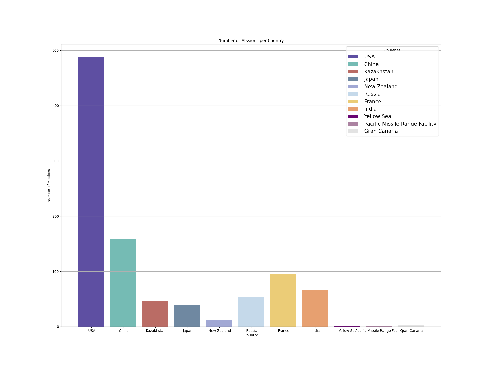
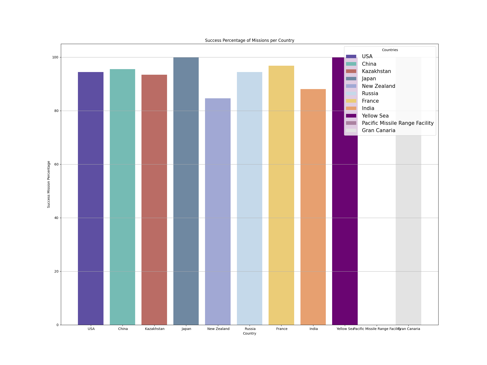

# Space Mission Data Analysis

    

## Overview

    
I decided to analyze data regarding space missions for a simple data processing, analysis, and visualization project.

    
The main focus of this project is the number of missions each country conducted and the percentage of success they had.

    
This project led me to conclude that is it necessary to consider the total number of samples before considering percentages to extract a good conclusion.

## Data Source

    
I extracted the data from a Kaggle project called: <a href="https://www.kaggle.com/code/kanncaa1/space-mission-from-1957-data-analysis/input" _target="blank">Space Mission from 1957 Data Analysis</a>

    
It is <b>required to log in</b> in order to download the CSV file. But beyond that is it free to get the data.

## Technologies

    
This project involves the usage of the following technologies:

    <ul>
        <li><b>Python</b></li>
        <li><b>Pandas</b></li>
        <li><b>Matplotlib</b></li>
    </ul>

## Graphs Extracted

    
The following are the graphs I created in base of the analysis I made

    

        
1. Graph about countries and the number of missions each of them conducted

         
    

     
    

        
2. Graph about countries and the percentage of successful missions each of them conducted.

        
    

## Conclusion

    
From the charts I conclude that <b>the United States of America is the most reliable country in regards to space missions</b> because it has a <b>high percentage of success missions</b> and it is the country that launched <b>the most space missions</b> according to the analyzed data set.

## Disclaimer

    
In case you found out a mistake about my analysis, please leave a comment to I can correct it.

## Copyright

    <blockquote>
        <a href="https://github.com/josewebdev2000">&copy; josewebdev2000</a> 2023
    </blockquote>

